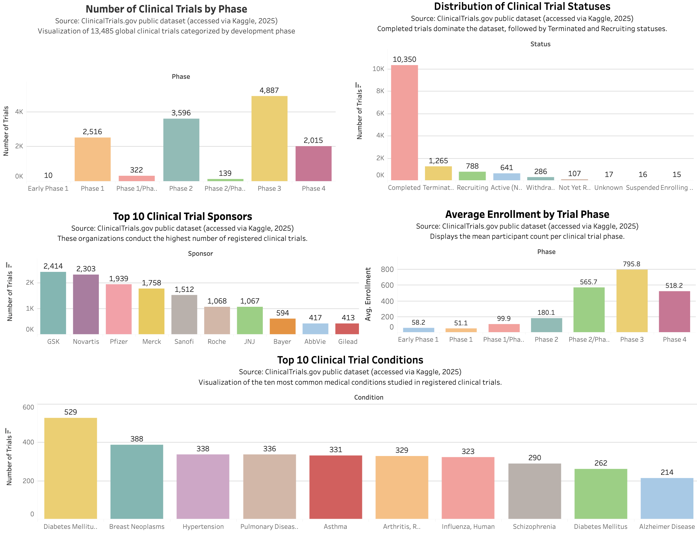

# Clinical Trial Insights Dashboard

### Overview
This project analyzes and visualizes global clinical trial data using Python and Tableau.  
The dataset was obtained from [ClinicalTrials.gov](https://clinicaltrials.gov/) (via Kaggle, 2025).  
It explores how research activity varies by study phase, enrollment size, status, sponsor, and medical condition.

---

### Objectives
- Clean and standardize raw clinical trial data using Python and pandas.
- Identify key insights such as:
  - Which trial phases have the most studies.
  - How participant enrollment changes across phases.
  - The most common medical conditions studied.
  - The top sponsors conducting trials.
- Create an interactive Tableau dashboard for clear, data-driven storytelling.

---

### Tools and Skills
| Tool | Purpose |
|------|----------|
| Python (pandas) | Data cleaning and preparation |
| Tableau Public | Data visualization and dashboard design |
| Git / GitHub | Version control and documentation |

---

### Repository Contents
| File | Description |
|------|--------------|
| `clinical_trials_cleaning.py` | Python script used for cleaning and standardizing the dataset |
| `cleaned_clinical_trials.csv` | Final cleaned dataset used for Tableau |
| `clinical-trials-dashboard.twb` | Tableau workbook file |
| `clinical-trials-dashboard.png` | Image preview of the dashboard |

---

### Key Insights
- Phase 3 trials dominate both in number and participant size.
- Sponsors such as GSK, Novartis, and Pfizer conduct the highest number of trials.
- Diabetes and cancer-related conditions are among the most studied globally.

---

### Interactive Dashboard
View the interactive Tableau dashboard here:  
**[Clinical Trial Dashboard on Tableau Public](https://public.tableau.com/views/clinical-trials-dashboard/Dashboard1?:language=en-US&:sid=&:redirect=auth&:display_count=n&:origin=viz_share_link)**

---

### Author
Created by **Khushi Patel** 
